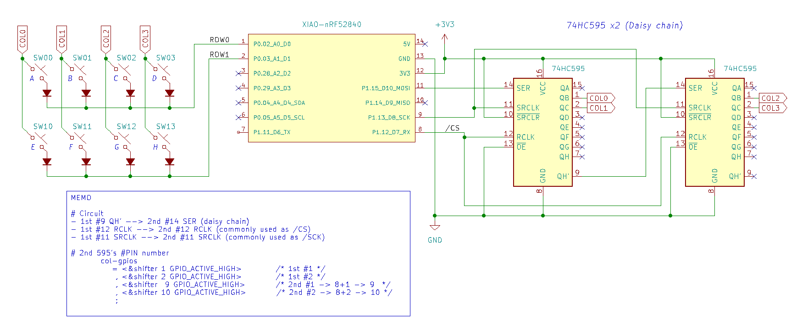

# ZMK sample project for shift-register

This project is for checking shift-register (74HC595).

- board: seeeduino_xiao_ble (XIAO nRF52840)
- shield: shift-reg
- modules: none

## Connection to XIAO nRF52840

## 74HC595 x2 (Daisy chained)



## Local Build
### Prerequisites
- ZMK [Native Setup](https://zmk.dev/docs/development/local-toolchain/setup/native)
- [cyme](https://github.com/tuna-f1sh/cyme) (for flashing firmware)

### Setup
```
# clone this repo
cd ~/Downloads
git clone git@github.com:hidsh/zmk-shift-reg.git

# cd to your `zmk/app` folder
cd PATH/TO/zmk/app

# create a symlink from makefile
ln -s ~/Downloads/zmk-shift-reg/shift-reg.mk ./Makefile
```

### Build
```
cd PATH/TO/zmk/app

# just `make` to build/flash firmware
make
```
## Links
- ZMK Official Documents / [Configuring Shift Registers](https://zmk.dev/docs/development/hardware-integration/shift-registers)

